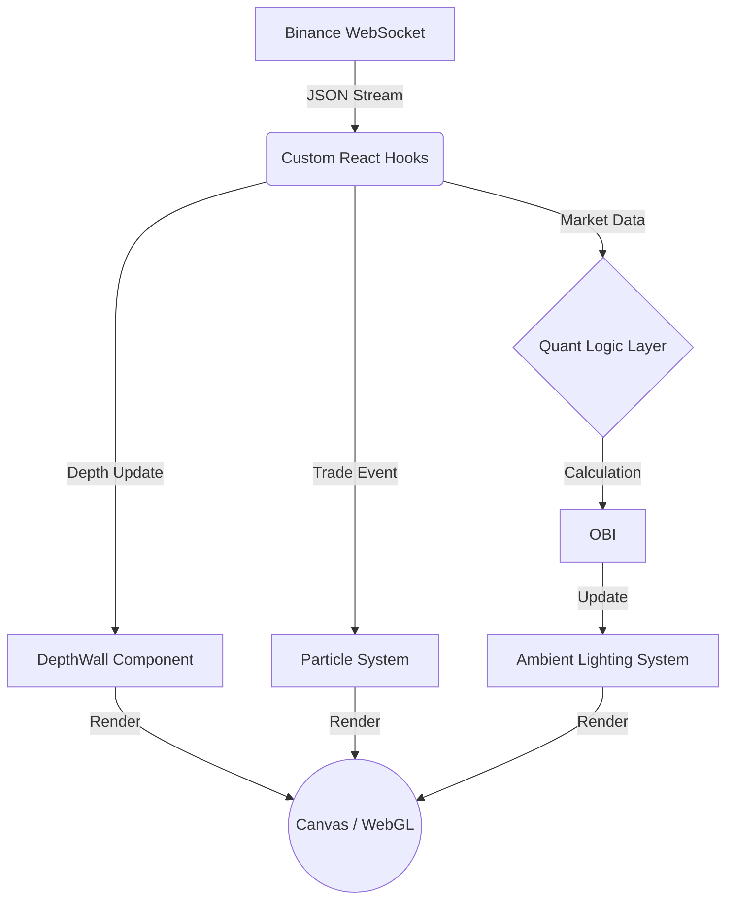

# 🌌 Market Matrix: Real-time 3D Financial Visualization


> **"Where Data Meets Cyberpunk."**
> A high-performance 3D visualization terminal for cryptocurrency markets, powered by React Three Fiber and Binance WebSocket streams.

---

## ⚡ Live Demo Preview

### [🚀 Click here to visit Live Site](https://market-matrix-qot215ipz-willys-projects-c9766811.vercel.app)

---

## 📖 Project Overview

**Market Matrix** is a specialized visualization tool designed for high-frequency trading monitoring. Unlike traditional 2D candlestick charts, it renders the **Limit Order Book (LOB)** as a dynamic 3D terrain and visualizes **Trade Flow** as a particle rain system.

This project demonstrates the intersection of **Quantitative Finance**, **Real-time Data Engineering**, and **WebGL Graphics**.

---

## ✨ Key Features

### 🟢 Core Visualization
* **3D Depth Mountains:** Real-time rendering of Bid/Ask depth. Height represents volume; geometry updates dynamically with WebSocket messages.
* **Trade Particle Rain:** Visualizes individual trade execution.
    * **Green Rain:** Buy orders.
    * **Red Rain:** Sell orders.
    * **Physics:** Particles fall from the "sky".

### 🟡 UX & Interaction
* **Multi-Asset Switcher:** Seamlessly switch between BTC, ETH, SOL, and DOGE. Implements proper **WebSocket lifecycle management** (auto-unsubscribe/subscribe) to prevent memory leaks.
* **Raycasting Tooltip:** Interactive 3D cursor. Hover over any depth bar to reveal precise **Price** and **Volume** data.
* **Cyberpunk HUD:** Real-time dashboard displaying:
    * **Network Latency (Ping):** Calculated from exchange timestamp vs. local receipt time.
    * **System Status:** Connection health monitoring.
    * **FPS Counter:** Performance metrics.

### 🔴 Quantitative Intelligence
* **⚖️ OBI (Order Book Imbalance) Lighting:** The scene's ambient lighting shifts color based on market pressure:
    * **Green Tint:** Bullish (Bid Volume > Ask Volume).
    * **Red Tint:** Bearish (Ask Volume > Bid Volume).

---

## 🛠 Technical Deep Dive (Why this matters)

This project solves several engineering challenges common in HFT (High-Frequency Trading) frontend development:

### 1. High-Frequency State Management
* **Challenge:** Crypto exchanges emit 1000+ depth updates per second. Standard React `useState` causes excessive re-renders.
* **Solution:** Utilized `useRef` for direct mutation of 3D objects and optimized React reconciliation strategies to maintain a smooth **60 FPS**.

### 2. 3D Mathematics & Interaction
* **Challenge:** Selecting a specific 3D bar in a moving scene.
* **Solution:** Implemented **Raycasting** algorithms to map 2D mouse coordinates to 3D world space, enabling precise data introspection in a 3D environment.

### 3. Latency & Observability
* **Challenge:** Traders need to know if the data is stale.
* **Solution:** Built a latency calculator: `Latency = Date.now() - TradePacket.EventTime`. This provides transparency on network performance.

---

## 🏗 Architecture



## 🚀 Getting Started
Prerequisites

- Node.js (v16+)

Installation

1. Clone the repo
```Bash
git clone https://github.com/WillyTsai1006/market-matrix.git
cd market-matrix
```
2. Install dependencies
```Bash
npm install
```
3. Run development server
```Bash
npm run dev
```
## 🔮 Roadmap
[x] Phase 1: Real-time Depth & Ticker visualization.

[x] Phase 2: Particle System

[x] Phase 3: UX/UI, Tooltips, and Multi-currency support.

[x] Phase 4: Quant Indicators (OBI Lighting).

[ ] Phase 5: C++ Backend Integration. (Connecting to custom HFT matching engine).

## 👨‍💻 Author
Willy Tsai

GitHub: github.com/WillyTsai1006

Built with ☕ and code in 2026.